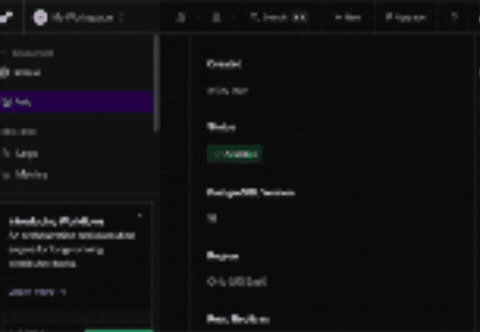

# WEB103 Project 2 - *Calisthenics Moves*

Submitted by: **Sarin**

About this web app: **A list of calisthenics (bodyweight) exercises from beginner to advanced. Each move shows its muscle group, difficulty, and a how-to description. All data is stored in a Render PostgreSQL database and served to the frontend through an Express API.**

Time spent: **8** hours

## Required Features

The following **required** functionality is completed:

<!-- Make sure to check off completed functionality below -->
- [x] **The web app uses only HTML, CSS, and JavaScript without a frontend framework**
- [x] **The web app is connected to a PostgreSQL database, with an appropriately structured database table for the list items**
  - [x] **NOTE: Your walkthrough added to the README must include a view of your Render dashboard demonstrating that your Postgres database is available**
  - [x]  **NOTE: Your walkthrough added to the README must include a demonstration of your table contents. Use the psql command 'SELECT * FROM tablename;' to display your table contents.**

The following **optional** features are implemented:

- [ ] The user can search for items by a specific attribute

The following **additional** features are implemented:

- [x] Each exercise has its own detail page (e.g. `/exercises/dip`) that loads its data from the database
- [x] Visiting a detail page for an exercise that doesn't exist redirects to a custom 404 page
- [x] Exercises are displayed as cards in a responsive grid

## Video Walkthrough

Here's a walkthrough of implemented required features:

<!-- Replace this with whatever GIF tool you used! -->
GIF created with macOS Screen Recording, converted to GIF online

## Notes

Challenges I ran into:
- Connecting to Render from my laptop required the full external hostname (ending in `.ohio-postgres.render.com`), not the short internal hostname.
- Small syntax mistakes, like mismatched quotes and using regular quotes instead of backticks for template strings, caused errors I had to track down.
- Installing `psql` with Homebrew so I could check the table contents from the terminal.

## License

Copyright 2026 Sarin

Licensed under the Apache License, Version 2.0 (the "License"); you may not use this file except in compliance with the License. You may obtain a copy of the License at

> http://www.apache.org/licenses/LICENSE-2.0

Unless required by applicable law or agreed to in writing, software distributed under the License is distributed on an "AS IS" BASIS, WITHOUT WARRANTIES OR CONDITIONS OF ANY KIND, either express or implied. See the License for the specific language governing permissions and limitations under the License.